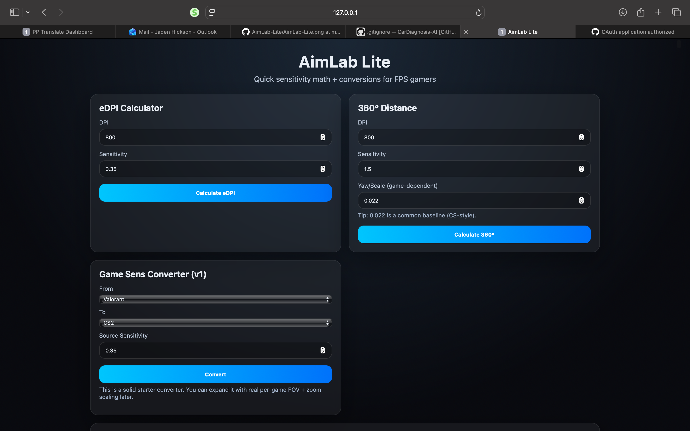

# AimLab Lite

A gamer-focused web app that calculates eDPI, estimates 360° distance, and converts sensitivity between popular FPS games.
## Features
- eDPI calculator
- 360° distance estimator
- Sensitivity converter (v1)

## Tech
- Python (Flask)
- HTML/CSS/JS


## Run locally
```bash
pip install -r requirements.txt
python app.py
